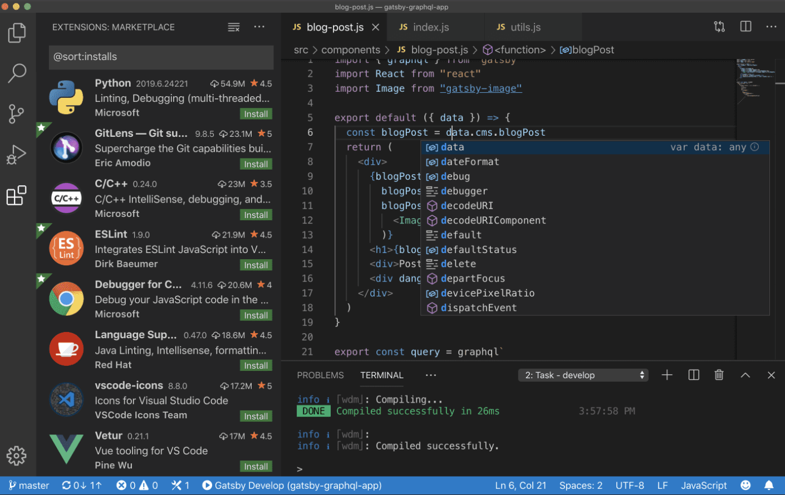
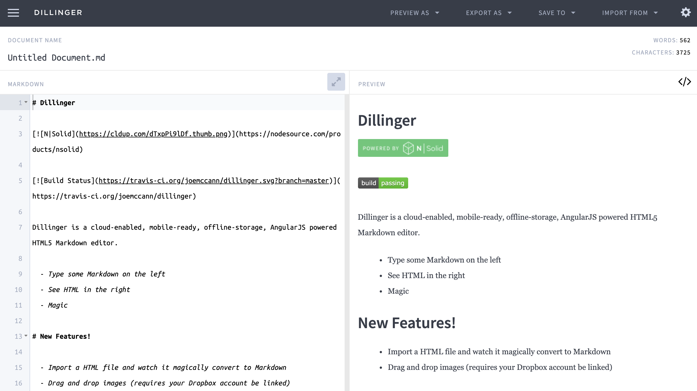
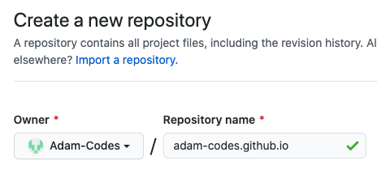
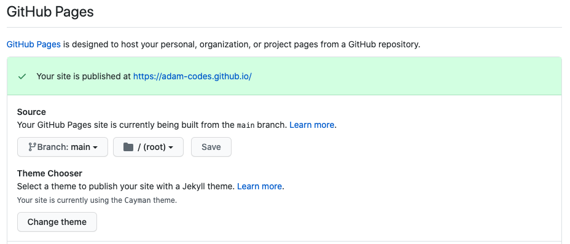
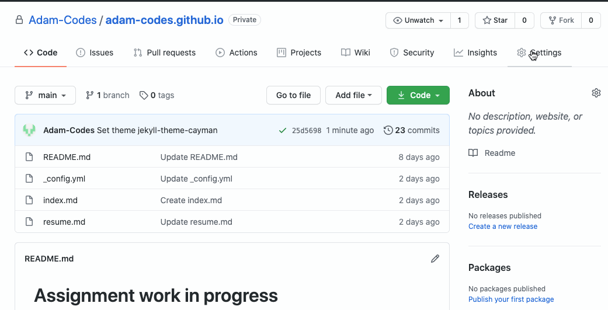
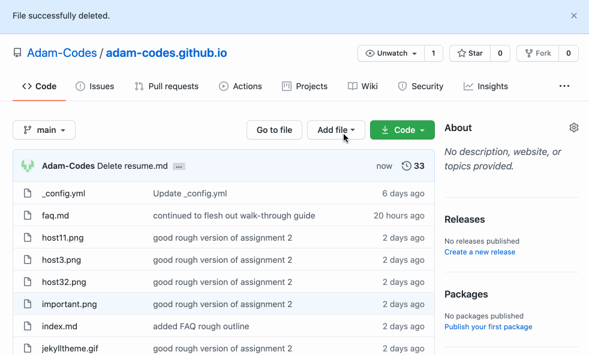

# How to host a resume using GitHub pages

## Audience Profile
**Audience**: CS Student

**Venue**: README in GitHub Pages

**Additional purpose**: Introduce and demo principles of Andrew Etter's book Modern Technical Writing

**Desired reaction**: Encouraged, feeling that they can achieve the outcome and more

**Vocabulary**: Technical, jargon

**Tone**: Casual, familiar, yet concise

#### Prerequisites:
* GitHub account
* basic understanding of GitHub version control
* Your resume formatted in Markdown
    * It is incredibly fast to [learn markdown](https://guides.github.com/features/mastering-markdown/)

----
## What we are doing...
A resume is critical to computer science employment. Every job applied for will require an accompanying resume that covers one's skills and abilities that are relevant to the position being applied for.

A simple, modern way to share and host a resume is through the use of a combination of technologies, namely:
1. Jekyll - static site generator
2. Github Pages - webpage host
3. Markdown with editor - our [lightweight markup language](https://en.wikipedia.org/wiki/Lightweight_markup_language)

There are many options to host a website and just as many ways in which content and code can be written for those websites.
Authoring a webpage and hosting it can range in flexibility and complexity and one would be wise to match the tool to the task at hand. 

### _Our_ task(s) at hand are to:
1. Create a resume in Markdown
2. Create a GitHub Pages repository
3. Host our resume on GitHub Pages and 
4. Make our resume look professional by styling it using Jekyll templates to generate our static site

We don't need to over-engineer a solution that will be more trouble than it's worth; we want a solution that is dead simple, easy to maintain and leaves us with the capability to expand or change technologies in the future. Hosting a resume on GitHub Pages in combination with a static site generator such as Jekyll gives us many advantages:

* Use of a popular distributed version control system (DVCS)
    * Allows others to easily contribute; now or in the future.
    * Provides _real experience_ with a DVCS one could use on their resume.
* Building and hosting a static website is trivial
    * A static site is:
        * fast
        * simple
        * portable
        * secure
    * Nothing to install or hack and can be **hosted** or **migrated** with minimal effort
    * GitHub handles all the basic dependencies for us
* Can be written in GitHub Flavored Markdown Language
    * Simple, easy to learn and near universal
    * Lightweight markdown language, combined with Jekyll allows for easy styling and beautiful looking static content with minimal effort
    > start here [quickly learn Markdown](https://helloacm.com/markdown-markup-language-quick-tutorial/)
* Using GitHub makes you look more "technical" to employers
    * Wherever you work, version control will be essential, this demonstrates proficiency with github (because you truly will be gaining experience)


## Let's get started
### Setting up our tools

THIS IS A GOOD SPOT FOR MORE RESOURCES
#### [GitHub](https://github.com)
>GitHub is a distributed version control system(DVCS). It is popular and free. 
Github has a feature called github pages which allows one repository to act as a static website. DVCS allow for multiple people working on the same document, on or offline with versioning built in. For the purposes of this activity, it would allow you to keep a versioned history of your resume changes. It could potentially allow a colleague or friend to contribute to your resume, or provide feedback. If you don't have experience, it is an excellent tool to get your foot in the door. You will use some form of it for the rest of your career
One simply needs to create or use their existing github account, use a markdown editor of choice. 

If you don't currently have a github account, it's an excellent time to [create one](www.github.com).

PROVIDE A LINK HERE FOR LEARNING THE GIT VERSION CONTROL FLOW

#### Markdown editor ([VS Code](https://code.visualstudio.com) or [Dillinger](https://dillinger.io))
>Markdown editor provides syntax highlighting, word completion, etx making it easier to read and write in markdown language. Often allowing for a live preview and best of all, free.

When just starting out learning it's important to keep it simple, therefore I recommend two options for markdown editors:
1. [VS Code](https://code.visualstudio.com) (can be made more **powerful** with the use of [Markdown related extensions](https://marketplace.visualstudio.com/search?term=markdown&target=VSCode&category=All%20categories&sortBy=Relevance))

2. An online editor such as [Dillinger](https://dillinger.io)



If you are lacking confidence, [Dillinger](www.dillinger.io) is the simplest way to get started and provides a live preview that will allow you learn quickly through experimentation. However, this is a great time to get your feet wet with some tools you will likely use in your future computer science career; so just use [VS Code](https://code.visualstudio.com).

>Personally, I prefer VS Code, as it's a tool I am familiar with and is widely used in the computer science community. The extensions make this application infinitely customizable and make you feel like a hacker.


#### Jekyll and Markdown

>[Jekyll](https://jekyllrb.com) is a Static site generator that Takes our lightweight markup language and turns it into a working website. Allowing you to apply styling, templates and configuration.

>Markdown lightweight markup language (specifically [GitHub flavored markdown](https://github.github.com/gfm/#what-is-github-flavored-markdown-)). Similar to html, is more focused on providing context to content but easy to learn, easy to read

The ability to use Jekyll & markdown is built right into GitHub Pages! There is nothing we need to do, GitHub takes care of the dirty work for us. Woo Woo! Told you it was simple!)
>
### Write/Convert your resume to Markdown language
There are many guides and Markdown is quick and simple to learn. Here's a guide I recommend to
[learn Markdown](https://guides.github.com/features/mastering-markdown/).

### Configure GitHub pages
In order for us to host a webpage, we need a place to host it. This can be done through the following steps: 
### 1. Create a new \<accountname\>.github.io reposity
 The name of the repository is important. It **needs** to be prefixed with your Github account name: `<accountname>.github.io`

>    
    
### 2. Select a Jekyll style
Go to **Settings** for our newly created repository

>    

### 3. Scroll down to the *GitHub Pages* section.

>
### 4. Select '**Change theme**' 


### 5. Select your desired theme
Scroll through to see the example templates, when you find one you like press **Select theme**

>
Voila!
That is all we need for the basic configuration; I told you it was dead simple.
The address for your new webpage is `<accountname>.github.io`


## How to get your content onto github
Thanks to the use of GitHub as a DVCS, we have a number of ways in which we can work with GitHub:
* web interface (live / raw editor)
* terminal
* desktop client

For brevity purposes I will describe how to use the web interface, but if you have any experience with GitHub I trust you can happily use the method of your preference. 

For the purposes of this walk-through, I will leave it to you to use or learn which format suits you best. Most employers would expect some experience using git from terminal. To gain the benefits (and experience) of using git version control one should really use the terminal.
If you run into trouble, you are going to have to use your google ninja / stack overflow skills. You've been warned.
[Here is a great place to start](https://product.hubspot.com/blog/git-and-github-tutorial-for-beginners) if you would like to go down that rabbit hole.

The steps below will get you started and introduces you to the absolute minimum (or some would argue not even that) of Git and version control. Professional use of git would include a specific branching strategy instead of just using one branch `main` in our example below. This is just enough to get you started (and into trouble).
This is a surprisingly complex topic and you will spend your career learning about it. If you run into trouble you are going to have to rely on your StackOverflow and Google-fu skills; just as you will later in your career.
 > You owe it to yourself to **invest** the 10 minutes of time it would take to read the [Git Handbook](https://guides.github.com/introduction/git-handbook/)

### Creating your content


#### From the Main / **Code** Tab
1. Create a new file
    * Click **Add File**.
    * Select **Create new file**.
2. Paste content
    * Paste your markdown content (created in your Markdown editor of choice) into the file.
>Note: You can use the **Preview** tab to take a quick peek and ensure the content looks the way you expect.
3. Commit Message
    * Leave a useful note for your future-self regarding the changes that were made
4. Commit (and publish) the changes!
    * This commits the change and makes it live.
5. View your changes!
    * go to your web address \<`accountName`\>`.github.io` to see your resume styled with your chosen Jekyll theme. 
> Note: It may take up to 5 minutes for your to see the change live on your website

## More resources
The beautify of VS code if you are not already familiar with it, is that it is infinitely customizable through the use of extensions. One in particular I would recommend is [Markdown Preview Github Styling](https://marketplace.visualstudio.com/items?itemName=bierner.markdown-preview-github-styles0)

[Learn markdown](https://guides.github.com/features/mastering-markdown/)

The concepts from this tutorial have been based on the concepts from Andrew Etter's book [Modern Technical Writing](https://www.amazon.com/Modern-Technical-Writing-Introduction-Documentation-ebook/dp/B01A2QL9SS)
## Authors and Acknowledgments
**Author:** Adam Andritz

**Template Author** Jekyll - Cayman

**Contributors** \<Group Members\>

## FAQs
#### I made a change to my page and saved/committed it, but I don't see the change when I refresh my browser
Changed may take anywhere from 1-5minutes to update. It's just the nature of github and web hosting
#### I can't get my github flavour markdown tables to display properly with Jekyll themes... what gives?
One will need to edit the `_config.yml` file with a little magic:
```
markdown: kramdown
redcarpet:
  extensions:
    - no_intra_emphasis
    - fenced_code_blocks
    - autolink
    - tables
    - strikethrough
    - superscript
    - with_to_data
```
#### I am using VS Code to write my resume in MarkDown, is there a spell checker?
VS Code is very powerful through the use of extensions. For example, [take your pick](https://marketplace.visualstudio.com/search?term=spellcheck&target=VSCode&category=All%20categories&sortBy=Relevance)

#### Why is Markdown better than a word processor?
Markdown is better than a word processor for the following reasons:
* Markdown is more transportable (not stuck with `.docx`)
* Markdown is free (unlike microsoft office)
* You can format content and headers without your hands needing to leave the keyboard
* It makes you look more like a computer scientist
