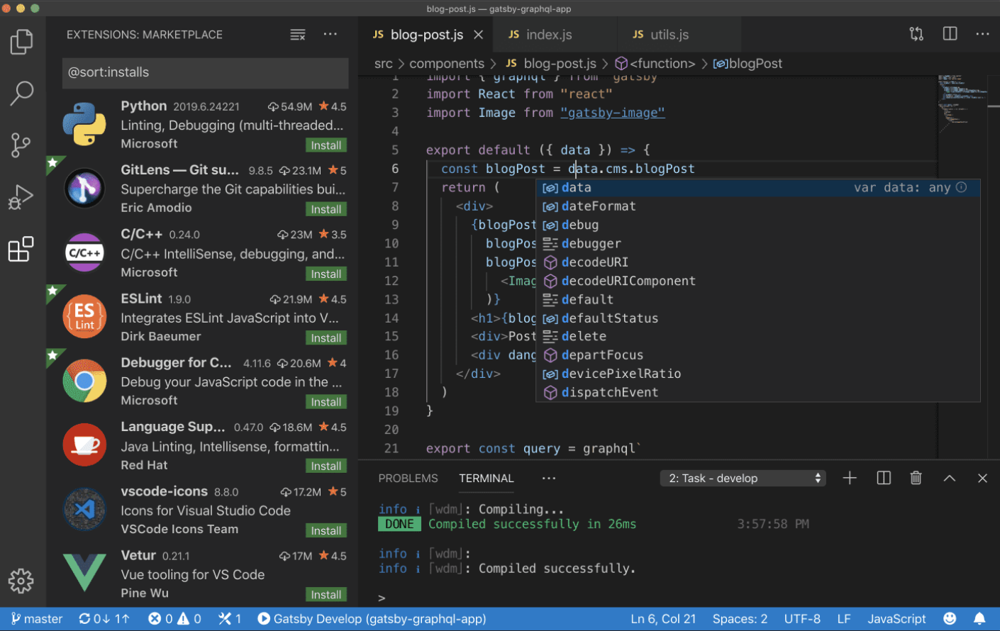
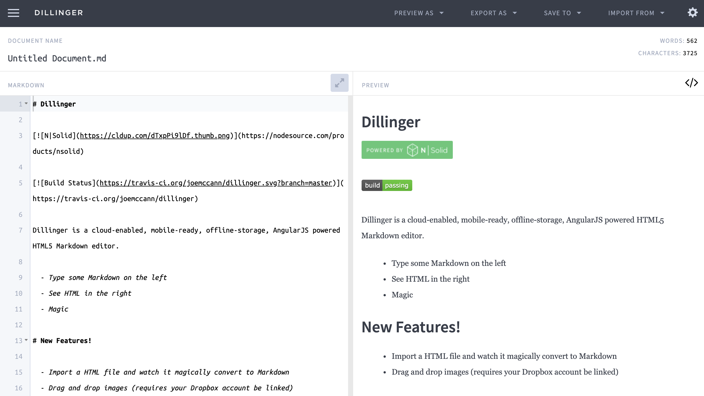
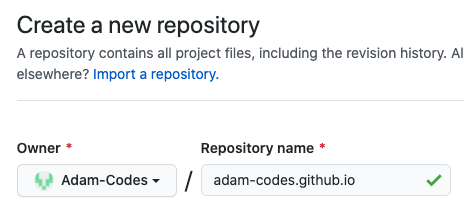
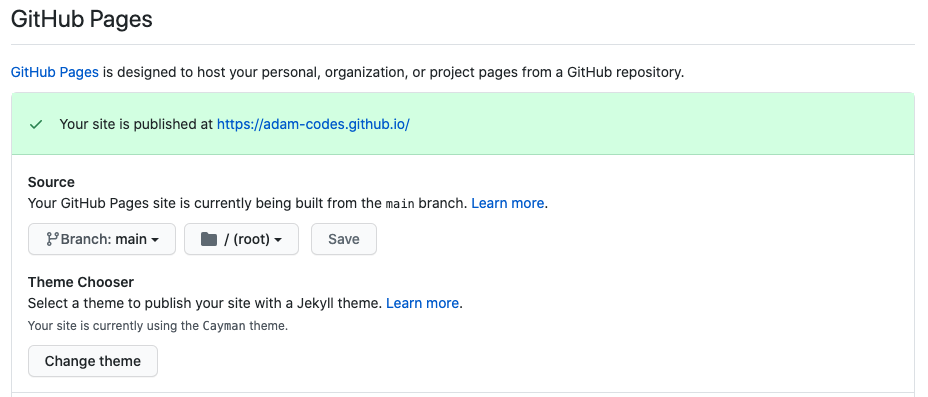
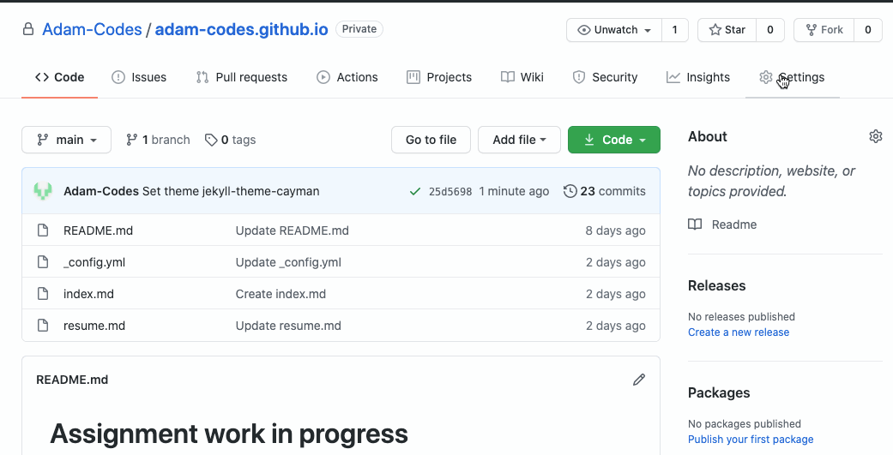
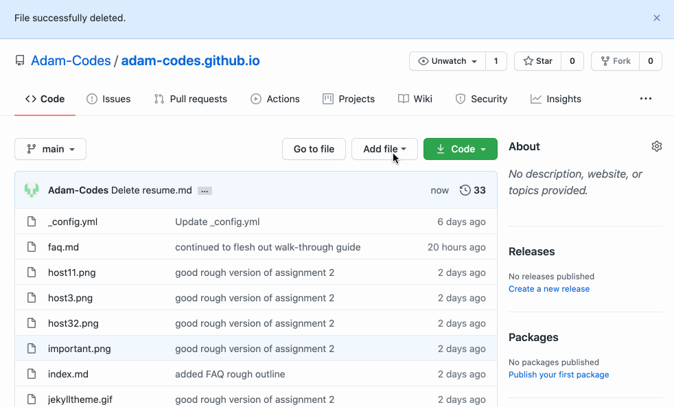

# How to host a resume using GitHub pages
## Summary
- [Prerequisites](#prerequisites)
- [Introduction](#Introduction)
- [Tutorial](#Tutorial)
- [More resources](#more-resources)
- [Author and Acknowledgements](#Authors-and-Acknowledgments)
- [FAQs](#faqs)


## Prerequisites:
* GitHub account
* basic understanding of GitHub version control
* Your resume formatted in Markdown


----
## Introduction
A resume is critical to computer science employment. Every job applied for will require an accompanying resume that covers one's skills and abilities that are relevant to the position being applied for. These steps and tool choices are based on the recommendations from [Andrew Etter](https://andyetter.com) and his book, ["Modern Technical Writing"](https://www.amazon.com/Modern-Technical-Writing-Introduction-Documentation-ebook/dp/B01A2QL9SS).

A simple, modern way to share and host a resume is through the use of a combination of technologies, namely:
1. Jekyll - static site generator
2. Github Pages - webpage host
3. Markdown with editor - our Lightweight Markup Language

There are many options to host a website and just as many ways in which content and code can be written for those websites.
Authoring a webpage and hosting it can range in flexibility and complexity and one would be wise to match the tool to the task at hand. 

### _Our_ task(s) at hand are to:
1. Create a GitHub Pages repository
2. Host a resume (in Markdown) on GitHub Pages and 
3. Make a resume look professional by styling it using Jekyll templates to generate a static site

Hosting a resume on GitHub Pages in combination with a static site generator such as Jekyll gives many advantages:

* Use of a popular distributed version control system (DVCS)
    * Allows others to easily contribute; now or in the future.
    * Provides _real experience_ with a DVCS one could use on their resume.
* Building and hosting a static website is trivial
    * A static site is:
        * fast
        * simple
        * portable
        * secure
    * Nothing to install or hack and can be **hosted** or **migrated** with minimal effort
    * GitHub handles all the basic dependencies
* Can be written in GitHub Flavored Markdown Language
    * Simple, easy to learn and near universal
    * Lightweight markdown language, combined with Jekyll allows for easy styling and beautiful looking static content with minimal effort

* Using GitHub makes one look more "technical" to employers
    * In a professional setting a DVCS is essential and employers are always looking for experience in this area


## Tutorial
### Setting up our tools

#### Markdown editor ([VS Code](https://code.visualstudio.com) or [Dillinger](https://dillinger.io))
>Markdown editor provides syntax highlighting, word completion  making it easier to read and write in markdown language. Often allowing for a live preview and best of all, these options are free.

When just starting out learning it's important to keep it simple, therefore I recommend two options for markdown editors:
1. [VS Code](https://code.visualstudio.com) can be made more **powerful** with the use of [Markdown related extensions](https://marketplace.visualstudio.com/search?term=markdown&target=VSCode&category=All%20categories&sortBy=Relevance)


2. An online editor such as [Dillinger](https://dillinger.io)


>Personally, I prefer VS Code, as it's a tool I am familiar with and is widely used in the computer science community. The extensions make this application infinitely customizable and make me feel like a _real hacker_.
>
>

#### Jekyll and Markdown

>[Jekyll](https://jekyllrb.com) is a Static site generator that Takes our lightweight markup language and turns it into a working website. Allowing you to apply styling, templates and configuration.


The ability to use Jekyll & Markdown is built right into GitHub Pages! There is nothing we need to do, GitHub takes care of the dirty work for us. Woo Woo! Told you it was simple!)
>


### Configure GitHub Pages
To configure GitHub Pages to host a resume: 
#### 1. Create a new \<accountname\>.github.io reposity
 The name of the repository is important. It **needs** to be prefixed with your Github account name: `<accountname>.github.io` 

>    
    
#### 2. Select a Jekyll style
Go to **Settings** for the newly created repository

#### 3. Scroll down to the *GitHub Pages* section.
>
#### 4. Select your desired theme
Scroll through to see the example templates, when you find one you like press **Select theme**, as shown in the gif below:

>

Voila!
That is all that is needed for the basic configuration.

The address for the new webpage is `<accountname>.github.io`


## How to get content onto github
Thanks to the use of GitHub as a DVCS, we have a number of ways in which we can work with GitHub:
* web interface (live / raw editor)
* terminal
* desktop client

For brevity purposes I will describe how to use the web interface, but if you have any experience with GitHub I trust you can happily use the method of your preference. 


The steps below will get you started and introduces you to the absolute minimum (or some would argue not even that) of Git and version control. This is a surprisingly complex topic and you will spend your career learning about it. Check [More Resources](#more-resources)


### Creating content
Next we will be uploading our content (resume) to GitHub, as shown in the gif below:


#### From the Main / **Code** Tab
1. Create a new file
    * Click **Add File**.
    * Select **Create new file**.
    * Name the file `index.md`
2. Paste content
    * Paste your markdown content (created in your Markdown editor of choice) into the file.
>Note: You can use the **Preview** tab to take a quick peek and ensure the content looks the way you expect.
3. Commit Message
    * Leave a useful note for your future-self regarding the changes that were made
4. Commit (and publish) the changes!
    * This commits the change and makes it live.
5. View your changes!
    * go to your web address \<`accountName`\>`.github.io` to see your changes.
> Note: It may take up to 5 minutes for your to see the change live on your website

## More resources
* The beauty of VS code is that it is infinitely customizable through the use of extensions. One in particular I would recommend is [Markdown Preview Github Styling](https://marketplace.visualstudio.com/items?itemName=bierner.markdown-preview-github-styles0)

* [Learn markdown](https://guides.github.com/features/mastering-markdown/)

* The concepts and tool recommendations from this tutorial have been based on the concepts from Andrew Etter's book [Modern Technical Writing](https://www.amazon.com/Modern-Technical-Writing-Introduction-Documentation-ebook/dp/B01A2QL9SS)
* Learn more about git as a concept using the [Git Handbook](https://guides.github.com/introduction/git-handbook/)

## Authors and Acknowledgments

**Author:** Adam Andritz

**Template Author:** Jekyll - Cayman

**Group Members:** Renan Desconsi Turra, Tuan Ngo

**Credit** to [mb21](https://stackoverflow.com/users/214446/mb21) from this [Stack Overflow post](https://stackoverflow.com/questions/26844701/lists-in-markdown-table-with-jekyll/57904161#57904161)
 for the fix to get tables to work in the [ FAQ](#FAQs)


## FAQs
#### I made a change to my page and saved/committed it, but I don't see the change when I refresh my browser
To see your updated content it may take anywhere from 1-5 minutes to update.
#### I can't get my GitHub Flavored Markdown tables to display properly with Jekyll themes... what gives?
In order to get GitHub Flared Markdown tables to work in Jekyll themes One will need to edit the automatically generated `_config.yml` file with a little magic:
```
markdown: kramdown
redcarpet:
  extensions:
    - no_intra_emphasis
    - fenced_code_blocks
    - autolink
    - tables
    - strikethrough
    - superscript
    - with_to_data
```
#### I am using VS Code to write my resume in MarkDown, is there a spell checker?
VS Code is very powerful through the use of extensions. For example, [take your pick](https://marketplace.visualstudio.com/search?term=spellcheck&target=VSCode&category=All%20categories&sortBy=Relevance)

#### Why is Markdown better than a word processor?
Markdown is better than a word processor for the following reasons:
* Markdown is more transportable (not stuck with `.docx`)
* Markdown is free (unlike microsoft office)
* You can format content and headers without your hands needing to leave the keyboard
* It makes you look more like a computer scientist
