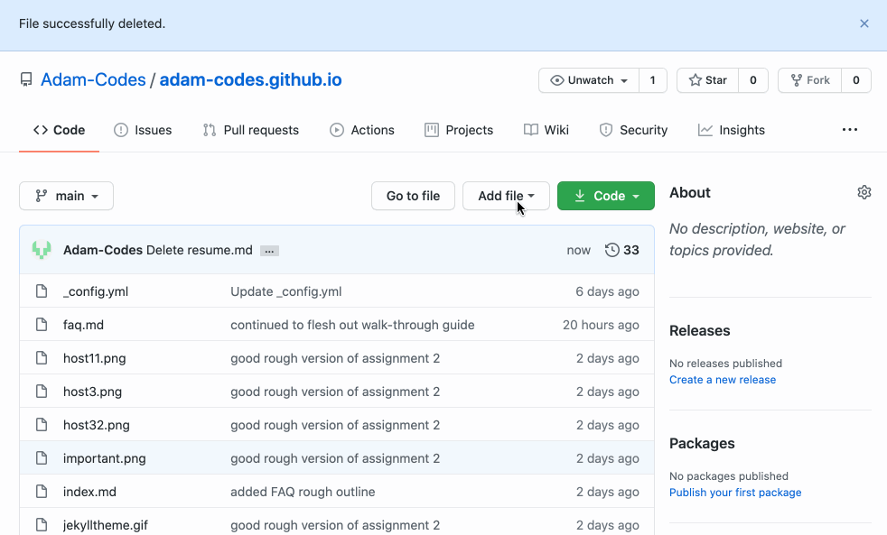

# How to host a resume using github pages

## Audience Profile
**Audience**: CS Student

**Venue**: README in Gihub Pages

**Additional purpose**: Introduce and demo principles of Andrew Etter's book Modern Technical Writing

**Desired reaction**: Encouraged, feeling that they can achieve the outcome and more

**Vocabulary**: Technical, jargon

**Tone**: Casual, yet consice

#### Prerequisites:
* github account
* Basic knowledge in the use of terminal (or equivalent)

## GitHub Pages is a natural fit to host a resume
A resume is critical to computer science employment, every job applied for will require an accompanying resume that covers one's skills and abilities that are relevant to the position being applied for.

A simple, modern way to share and host a resume is through the use of a combination of technologies, namely:
1. Jekyll - A static site generator
2. Github Pages - Our webpage host
3. Markdown with editor? - The language in which we will write our resume in

##### Hosting a resume on github pages, using a static site generator such as Jekyll has the happy side effects of:

* Using a popular version control system (github)
    * making it easier for others to contribute if you so chose in your future website
    * giving you real experience in a version control system and you can put that on your resume (enough said)
* Makes building and hosting a static website trivial
* A static site is fast, simple, portable and secure
    * nothing to install or hack and can be hosted or migrated with minimal resources
* Can be written in markdown languages (which is also simple, easy to learn and universal)
* lightweight markdown language, combined with Jekyll allows you to produce beautiful looking static content with minimal effort
* It makes you look more "technical" to employers as you bring them to your github page
    * wherever you work, version control will be essential, this demonstrates proficiency with github (because you truly will be gaining experience)

There are many options to host a website and just as many ways in which content and code can be written for those websites.
Authoring a webpage and hosting it can range in flexibility and complexity and one would be wise to match the tool to the task at hand. _Our_ task at hand is to create and host a resume. As such, we don't need to over-engineer a solution, we want a solution that is dead simple, easy to maintain and leaves us with easy ability to expand on in the future or change technologies completely. With Github pages, in it's most simple form, all the dependecies are managed by Github. However, if you chose to expand, you can take the dependencies into your own hands (lots of room to grow).

## Our Tools
### [Jekyll](https://jekyllrb.com)
>Is a Static site generator that Takes our lightweight markup language and turns it into a working website. Allowing you to apply styling, templates and configuration.

### [GitHub](https://github.com)
>github is a distributed version control system(DVCS). It is popular and free. 
Github has a feature called github pages which allows one repository to act as a static website. DVCS allow for multiple people working on the same document, on or offline with versioning built in. For the purposes of this activity, it would allow you to keep a versioned history of your resume changes. It could potentially allow a colleague or friend to contribute to your resume, or provide feedback. If you don't have experience, it is an excellent tool to get your foot in the door. You will use some form of it for the rest of your career
PROVIDE A LINK HERE FOR LEARNING THE GIT VERSION CONTROL FLOW
### Markdown (specifically [GitHub flavored markdown](https://github.github.com/gfm/#what-is-github-flavored-markdown-))
>lightweight markup language. Similar to html, is more focused on providing context to content but easy to learn, easy to read
### Markdown editor ([VS Code](https://code.visualstudio.com) or [Dillinger](https://dillinger.io))
>Provides syntax highlighting, word completion, etx making it easier to read and write in markdown language. Often allowing for a live preview and best of all, free.

## Getting everything setup
### Tools
One simply needs to create or use their existing github account, use a markdown editor of choice. 
>If you don't currently have a github account, it's an excellent time to [create one](www.github.com).

#### markdown editor
When just starting out learning it's important to keep it simple, therefore I recommend two options for markdown editors:
1. [VS Code](https://code.visualstudio.com) (can be made more **powerful** with the use of [Markdown related extensions](https://marketplace.visualstudio.com/search?term=markdown&target=VSCode&category=All%20categories&sortBy=Relevance))
2. An online editor such as [Dillinger](https://dillinger.io)

If you are lacking confidence, Dillinger is the simplest way to get started and provides a live preview that will allow you learn quickly through experimentation. However, this is a great time to get your feet wet with some tools you will likely use in your future computer science career; so just use VS Code.

Personally, I prefer VS Code, as it's a tool I am familiar with and is widely used in the computer science community.

#### Jekyll and markdown 
The ability to use Jekyll & markdown is build right into github pages! There is nothing we need to do, github takes care of the dirty work for us.

>
(Woo Woo! Told you it was simple!)
#### VS Code (or Dillinger)
Use VS Code and download some excellent extensions.
There are many different of flavors of markdown. Specifically we will be looking at and using [GitHub flavor markdown](https://github.github.com/gfm/)
The beautify of VS code if you are not already familiar with it, is that it is infinitely customizable through the use of extensions. One in particular I would recommend is [Markdown Preview Github Styling](https://marketplace.visualstudio.com/items?itemName=bierner.markdown-preview-github-styles0)

To skip this nonsense of installing another application you can simply go to [www.dillinger.io](https://dillinger.io)

### Configure GitHub pages
In order for us to host a webpage, we need a place to host it. This can be done through the following steps: 
#### 1. Create a new \<accountname\>.github.io reposity
 The name of the repository is important. It **needs** to be prefixed with your Github account name: `<accountname>.github.io`

>    
    
#### 2. Select a Jekyll style
Go to **Settings** for our newly created repository

>    

scroll down to the *GitHub Pages* section.

Select '**Change theme**' 

>

From here we are give the option to apply the specific theme of our chosing.

Voila!
That is all we need for the basic configuration; I told you it was dead simple.
The address for your new webpage is `<accountname>.github.io`

Now when you go to resume you will view your resume in md

## How to get your content onto github
### options:
* live / raw editor

    *   This is what we will be covering today. If you would like to use one of the tools listed below, I will assume you have enough experience to have that preference and that you know what you are doing
* terminal
* desktop client

For the purposes of this walk-through, I will leave it to you to use or learn which format suits you best. Most employers would expect some experience using git from terminal. To gain the benefits (and experience) of using git version control one should really use the terminal.
If you run into trouble, you are going to have to use your google ninja / stack overflow skills. You've been warned.

This is just meant to get you started
What good is using version control if we don't take advantage of it?

#### Prerequisites:
* github pages repository created (see above)
* Basic knowledge in the use of terminal (or equivalent)

## Getting content on GitHub
The steps below will get you started and introduces you to the absolute minimum (or some would argue not even that). Professional use of git would include a specific branching strategy instead of just using one branch `main` in our example below. This is just enough to get you started (and into trouble).
This is a surprisingly complex topic and you will spend your career learning about it. If you run into trouble you are going to have to rely on your StackOverflow and Google-fu skills; just as you will later in your career.
 > You owe it to yourself to **invest** the 10 minutes of time it would take to read the [Git Handbook](https://guides.github.com/introduction/git-handbook/)

### Steps
From the home menu
#### 1. Create a new file
Click **Add File** and select **Create new file**

#### 2. Paste our markdown content into the file
Move the content you have written in your markdown editor here. You can use the **Preview** tab to take a quick peek and ensure the content looks the way you expect.
#### 3. Include a description (for versioning) of the change that we made
This is the beauty of version control. Use it to your advantage, leave a useful not for your future-self
#### 4. Commit (and publish) the changes!
This commits the change and makes it life.

> NOTE: It may take up to 5 minutes for your to see the change live on your website
