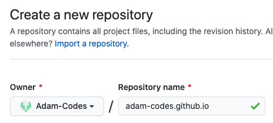

# Assignment work in progress


1. How to host a resume
this is a test?
# Purpose
To describe the practical steps of how to host and format a resume using Markdown, a markdown editor, github pages, jekyll
# Prerequisites
* Knowledge of Markdown
* Github account
* Markdown editor

# Audience Profile
**Audience**: CS Student

**Venue**: README in Gihub Pages

**Additional purpose**: Introduce and demo principles of Andrew Etter's book Modern Technical Writing

**Desired reaction**: Encouraged, feeling that they can achieve the outcome and more

**Vocabulary**: Technical, jargon

**Tone**: Casual, yet cosice


### Content to cover
1. format a resume using markdown
2. host using github pages
3. configuring Jekyll from github

# How do host your resume using github pages
**prerequisite** :
* github account
* Basic knowledge of github version control
## Steps
### 1. Create a new reposity (ensure that it is public)
The name of the repository needs to be named `<accountname>.github.io`
    
    
### 2. This will create a reposity that will act as your webpage host.
If you go to your repository name  `<accountname>.github.io`in the webbrowser, you will view the repository
### 3. Style the site with Jekyll
Go to settings     

scroll down to the *GitHub pages* section.

Select 'Change theme' 

Select and apply your Jekyll theme

Now when you go to resume you will view your resume in md

# How to format a resume using MarkDown
## Markdown?

#### The basic building blocks of markdown are:
There are different flavors and more complexities to markdown that you can pursue if you are interested, but for the purposes of this README this should be sufficient to understand the basics of creating a resume in markdown
> `#`  - Header   (`#` followed by space)
>
> `**` - **Bold** (`**Bold**`)
>
> `*`  - Bullets  (`*` followed by space)
>
> `_`  - _Italic_ (`_Italic_`)

## Nuts and bolts
Organize your resume with headers that are consistent and make sense
provide additional link to markdown
provide the basics

Headers H1-H6 which are used via the `#` the H number corresponds to the number of hashtags to use in descending order.
Example:
``` 
# This is the largest header h1
## this is the second largest header h2
.
.
.
###### This is the smallest header h6
```
># This is the largest header h1
>## this is the second largest header h2
>### .
>#### .
>##### .
>###### This is the smallest header h6

Use the building blocks to continue to organize the desired components of your resume
